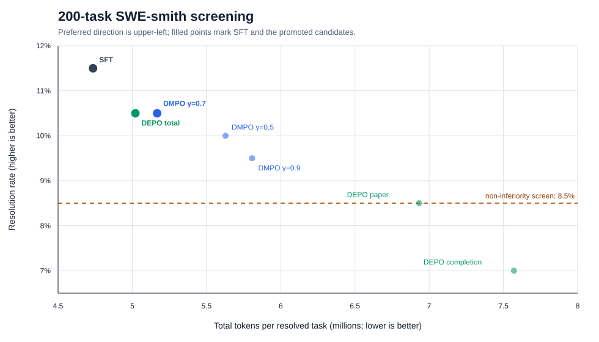
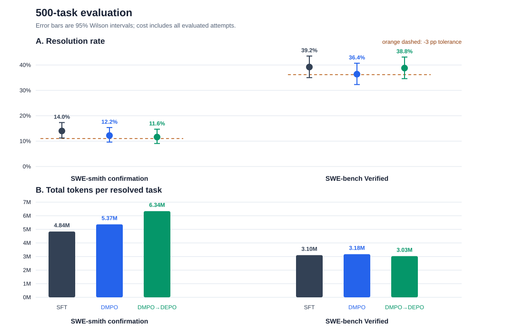
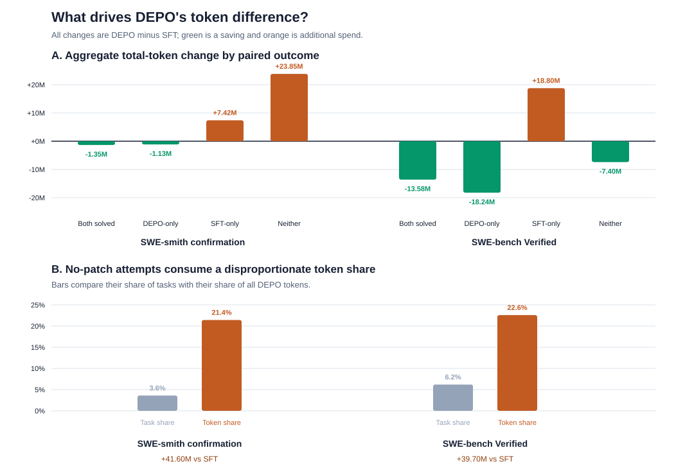
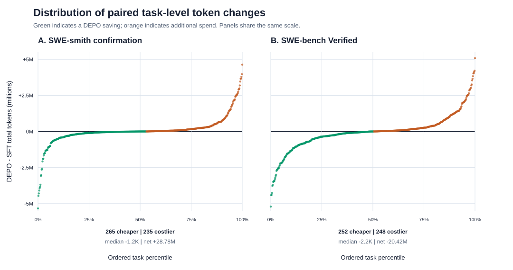
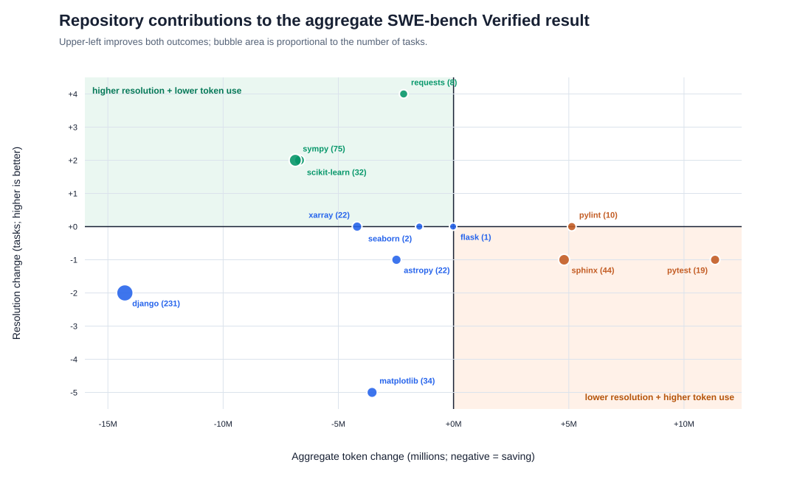

# Hyperparameter sweep results

SFT was the strongest model on SWE-smith. DMPO followed by DEPO was slightly
more token-efficient on SWE-bench Verified.

## 200-task screen

| Arm | Resolved | Mean tokens | Tokens per resolution | Eligible |
| --- | ---: | ---: | ---: | :---: |
| SFT | 23/200 (11.5%) | 544,596 | 4.74M | Yes |
| DMPO, `gamma=0.5` | 20/200 (10.0%) | 562,808 | 5.63M | Yes |
| DMPO, `gamma=0.7` | 21/200 (10.5%) | 542,602 | 5.17M | Yes |
| DMPO, `gamma=0.9` | 19/200 (9.5%) | 551,688 | 5.81M | Yes |
| DEPO paper | 17/200 (8.5%) | 589,251 | 6.93M | Yes |
| DEPO completion-balanced | 14/200 (7.0%) | 529,990 | 7.57M | No |
| DEPO total-balanced | 21/200 (10.5%) | 527,192 | 5.02M | Yes |

The screen selected DMPO `gamma=0.7` and total-balanced DEPO from their
respective model families.

## 500-task evaluations

### SWE-smith

| Arm | Resolved | Mean tokens | Tokens per resolution |
| --- | ---: | ---: | ---: |
| SFT | 70/500 (14.0%) | 0.678M | 4.84M |
| DMPO | 61/500 (12.2%) | 0.655M | 5.37M |
| DMPO to DEPO | 58/500 (11.6%) | 0.735M | 6.34M |

SFT had the best result. DEPO used 30.9% more tokens per resolution than SFT.

### SWE-bench Verified

| Arm | Resolved | Mean tokens | Tokens per resolution |
| --- | ---: | ---: | ---: |
| SFT | 196/500 (39.2%) | 1.217M | 3.105M |
| DMPO | 182/500 (36.4%) | 1.156M | 3.176M |
| DMPO to DEPO | 194/500 (38.8%) | 1.176M | 3.032M |

DEPO resolved two fewer tasks than SFT but reduced tokens per resolution by
2.4%. It was the selected arm for this benchmark.

## Task-level results

Token savings on some tasks were offset by higher costs on others, especially
unsuccessful attempts that produced no patch.

Most task-level differences were small, with a few large changes determining
the aggregate result.

The SWE-bench result varied by repository and was influenced by the benchmark's
repository mix.

## Note

These results come from one training seed and one rollout per task. The small
SWE-bench gain should not be treated as evidence of a general improvement.
